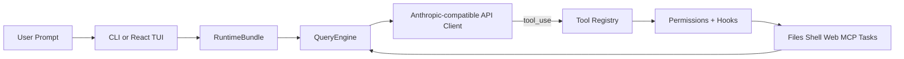

OpenHarness is organized into 14 subsystems. Each subsystem has a single, well-defined responsibility. Together they implement the complete agent harness pattern: from user input, through streaming model calls, to tool execution and result injection.

## Harness flow



A user prompt enters through the CLI or TUI, gets packaged into a `RuntimeBundle`, and is handed to the `QueryEngine`. The engine streams a response from the API client. When the model requests a tool, the call flows through the `ToolRegistry`, hits the `Permissions + Hooks` pipeline, executes against the underlying system (filesystem, shell, web, MCP server, task runner), and the result loops back into the engine for the next model turn.

## Source layout

```
openharness/
  engine/          # Agent Loop — query → stream → tool-call → loop
  tools/           # 43 Tools — file I/O, shell, search, web, MCP
  skills/          # Knowledge — on-demand skill loading (.md files)
  plugins/         # Extensions — commands, hooks, agents, MCP servers
  permissions/     # Safety — multi-level modes, path rules, command deny
  hooks/           # Lifecycle — PreToolUse/PostToolUse event hooks
  commands/        # 54 Commands — /help, /commit, /plan, /resume, ...
  mcp/             # MCP — Model Context Protocol client
  memory/          # Memory — persistent cross-session knowledge
  tasks/           # Tasks — background task management
  coordinator/     # Multi-Agent — subagent spawning, team coordination
  prompts/         # Context — system prompt assembly, CLAUDE.md, skills
  config/          # Settings — multi-layer config, migrations
  ui/              # React TUI — backend protocol + frontend
```

## Subsystem reference

<Columns cols={2}>
  <Card title="engine" icon="cpu">
    Owns the conversation history and runs the core `while True` agent loop. The `QueryEngine` streams model responses, dispatches tool calls, tracks token usage via `CostTracker`, and emits typed `StreamEvent`s for every phase of execution.
  </Card>
  <Card title="tools" icon="wrench">
    Houses all 43+ built-in tool implementations. Every tool extends `BaseTool`, declares a Pydantic `input_model` for validation, and exposes a JSON Schema via `to_api_schema()` so the model understands the tool automatically.
  </Card>
  <Card title="skills" icon="book-open">
    Loads on-demand Markdown knowledge files at runtime. Skills give the model domain expertise (git, security review, PDF, Excel) only when needed. Compatible with `anthropics/skills` — drop `.md` files into `~/.openharness/skills/`.
  </Card>
  <Card title="plugins" icon="plug">
    Manages the plugin lifecycle: discovery, installation, enable/disable. Plugins bundle commands, hooks, and agents into a single distributable unit. Compatible with `claude-code/plugins` format.
  </Card>
  <Card title="permissions" icon="shield">
    Evaluates every tool call against the active permission mode (`default`, `auto`, `plan`), path-level allow/deny rules, and a command deny-list. Returns a structured decision (allowed, denied, requires confirmation) before execution.
  </Card>
  <Card title="hooks" icon="bolt">
    Executes `PreToolUse` and `PostToolUse` lifecycle hooks registered by plugins or user configuration. Pre-hooks can block a tool call entirely; post-hooks are informational and fire after the result is known.
  </Card>
  <Card title="commands" icon="terminal">
    Implements 54 slash commands (`/help`, `/commit`, `/plan`, `/resume`, and more). Commands are discovered from built-in implementations and plugin-provided Markdown command files.
  </Card>
  <Card title="mcp" icon="globe">
    Model Context Protocol client. Connects to external MCP servers, discovers their tools, and proxies calls through the standard tool execution pipeline. MCP tools appear in the registry alongside built-in tools.
  </Card>
  <Card title="memory" icon="database">
    Manages persistent cross-session knowledge. Reads `CLAUDE.md` files from the project tree for context injection, writes and reads `MEMORY.md` for long-term facts, and handles auto-compaction when context grows too large.
  </Card>
  <Card title="tasks" icon="list-checks">
    Background task lifecycle management. Tools like `TaskCreate`, `TaskGet`, `TaskList`, `TaskUpdate`, and `TaskStop` let the model spawn long-running work and poll results without blocking the main conversation turn.
  </Card>
  <Card title="coordinator" icon="users">
    Multi-agent coordination layer. Provides subagent spawning via the `Agent` tool, a team registry for named agent groups, and the message-passing primitives (`SendMessage`) used by `ClawTeam`-style workflows.
  </Card>
  <Card title="prompts" icon="file-text">
    Assembles the system prompt for each turn. Combines the base system prompt, injected `CLAUDE.md` context, active skill content, and any append-system-prompt overrides provided at startup.
  </Card>
  <Card title="config" icon="settings">
    Multi-layer configuration resolution: defaults → global `~/.openharness/settings.json` → project `.openharness/settings.json` → CLI flags. Handles schema migrations between versions.
  </Card>
  <Card title="ui" icon="monitor">
    React/Ink terminal UI and its backend protocol. The TUI renders streaming text, permission dialogs, command pickers, mode switchers, and the session history browser. Communicates with the Python backend over a typed event stream.
  </Card>
</Columns>

## Key data flows

### Session startup

1. `config` resolves settings from all layers.
2. `prompts` assembles the initial system prompt (base + `CLAUDE.md` + skills).
3. `tools` and `mcp` populate the `ToolRegistry`.
4. `permissions` initializes the `PermissionChecker` from settings.
5. `plugins` loads enabled plugins, registering their commands and hooks.
6. `QueryEngine` is constructed with all of the above and handed to the UI or CLI.

### Tool call execution

```
QueryEngine.submit_message()
  └── run_query()  [engine/query.py]
        ├── api_client.stream_message()   → AssistantTextDelta events
        ├── AssistantTurnComplete         → token usage recorded
        └── _execute_tool_call()
              ├── hook_executor.execute(PRE_TOOL_USE)
              ├── permission_checker.evaluate()
              ├── tool_registry.get(name)
              ├── input_model.model_validate(input)
              ├── tool.execute(parsed_input, context)
              └── hook_executor.execute(POST_TOOL_USE)
```

### Output modes

The same `StreamEvent` stream powers three output modes:

<Tabs>
  <Tab title="Interactive TUI">
    The React/Ink frontend consumes events and renders streaming text, animated spinners during tool execution, and permission dialogs requiring keyboard input.
  </Tab>
  <Tab title="text (--output-format text)">
    Only `AssistantTextDelta` events are printed to stdout. Tool calls are silent. Suitable for piping output to other commands.
  </Tab>
  <Tab title="json / stream-json">
    All events are serialized as JSON objects. `json` waits for the full response; `stream-json` emits each event as it arrives. Suitable for programmatic consumption in scripts and pipelines.
  </Tab>
</Tabs>

<Note>
All 14 subsystems are importable independently. If you want to embed the agent loop in your own application, you can construct a `QueryEngine` directly without the CLI or TUI layers.
</Note>
