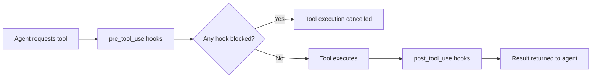

Hooks let you run custom logic at specific points in the agent lifecycle — before a tool executes, after it completes, or when a session starts or ends. You can use hooks for logging, security enforcement, approval gates, notifications, or any side effect you want tied to agent actions.

## How hooks work

When the agent invokes a tool, the executor runs every registered hook that matches the event and tool name. For `pre_tool_use` hooks, this happens before the tool executes. For `post_tool_use` hooks, this happens after the result is available.



If a hook has `block_on_failure: true` and fails (non-zero exit, HTTP error, or model rejection), the tool call is cancelled and the agent receives an error instead of a result.

## Hook events

| Event | When it fires |
|---|---|
| `pre_tool_use` | Immediately before a tool executes |
| `post_tool_use` | Immediately after a tool completes |
| `session_start` | When an agent session begins |
| `session_end` | When an agent session ends |

## Hook types

OpenHarness supports four hook types. Each is a different mechanism for running the hook action.

### command

Executes a shell command via `/bin/bash -lc`. The command runs in the current working directory with the event name and full payload available as environment variables.

<ParamField body="type" type="string" required>
  Must be `"command"`.
</ParamField>

<ParamField body="command" type="string" required>
  Shell command to execute. Use `$ARGUMENTS` anywhere in the string to inject the full JSON event payload.
</ParamField>

<ParamField body="matcher" type="string">
  Glob pattern matched against the tool name. If omitted, the hook runs for all tools on this event. For example, `"Bash"` matches only the Bash tool; `"Write*"` matches `Write` and any tool starting with `Write`.
</ParamField>

<ParamField body="timeout_seconds" type="number" default="30">
  Seconds to wait before killing the process. Minimum `1`, maximum `600`.
</ParamField>

<ParamField body="block_on_failure" type="boolean" default="false">
  If `true` and the command exits with a non-zero status, the tool call is cancelled.
</ParamField>

### prompt

Asks the model to validate a condition. The model receives the hook prompt along with the event payload injected via `$ARGUMENTS`, and must respond with `{"ok": true}` or `{"ok": false, "reason": "..."}`.

<ParamField body="type" type="string" required>
  Must be `"prompt"`.
</ParamField>

<ParamField body="prompt" type="string" required>
  Validation prompt sent to the model. Use `$ARGUMENTS` to embed the event payload.
</ParamField>

<ParamField body="model" type="string">
  Model to use for validation. Defaults to the session's configured model.
</ParamField>

<ParamField body="matcher" type="string">
  Glob pattern matched against the tool name. Omit to match all tools.
</ParamField>

<ParamField body="timeout_seconds" type="number" default="30">
  Seconds to wait for the model response. Minimum `1`, maximum `600`.
</ParamField>

<ParamField body="block_on_failure" type="boolean" default="true">
  If `true` and the model returns `{"ok": false}`, the tool call is cancelled.
</ParamField>

### http

POSTs the event payload as JSON to an HTTP endpoint.

<ParamField body="type" type="string" required>
  Must be `"http"`.
</ParamField>

<ParamField body="url" type="string" required>
  The URL to POST to. The request body is `{"event": "<event_name>", "payload": {...}}`.
</ParamField>

<ParamField body="headers" type="object" default="{}">
  Additional HTTP headers to include in the request. Useful for authentication or content-type overrides.
</ParamField>

<ParamField body="matcher" type="string">
  Glob pattern matched against the tool name. Omit to match all tools.
</ParamField>

<ParamField body="timeout_seconds" type="number" default="30">
  Seconds to wait for the HTTP response. Minimum `1`, maximum `600`.
</ParamField>

<ParamField body="block_on_failure" type="boolean" default="false">
  If `true` and the server returns a non-2xx status, the tool call is cancelled.
</ParamField>

### agent

Like `prompt`, but the model is instructed to reason more carefully before deciding. Use this for heavier validation logic where a simple prompt check is not enough.

<ParamField body="type" type="string" required>
  Must be `"agent"`.
</ParamField>

<ParamField body="prompt" type="string" required>
  Validation prompt sent to the model. Use `$ARGUMENTS` to embed the event payload.
</ParamField>

<ParamField body="model" type="string">
  Model to use for validation. Defaults to the session's configured model.
</ParamField>

<ParamField body="matcher" type="string">
  Glob pattern matched against the tool name. Omit to match all tools.
</ParamField>

<ParamField body="timeout_seconds" type="number" default="60">
  Seconds to wait for the model response. Minimum `1`, maximum `1200`.
</ParamField>

<ParamField body="block_on_failure" type="boolean" default="true">
  If `true` and the model returns `{"ok": false}`, the tool call is cancelled.
</ParamField>

---

## Context passed to hooks

Every hook receives the event context through two channels:

**Environment variables** (available to `command` hooks):

| Variable | Content |
|---|---|
| `OPENHARNESS_HOOK_EVENT` | Event name, e.g. `pre_tool_use` |
| `OPENHARNESS_HOOK_PAYLOAD` | Full JSON payload for the event |

**`$ARGUMENTS` substitution** (available to `command`, `prompt`, and `agent` hooks):

Write `$ARGUMENTS` anywhere in a `command` string or `prompt` string. OpenHarness replaces it with the JSON-serialized event payload before executing the hook.

The payload for tool events includes:

| Field | Description |
|---|---|
| `tool_name` | Name of the tool being invoked (e.g. `"Bash"`, `"Write"`) |
| `input` | The tool's input arguments as a JSON object |
| `cwd` | Working directory of the session |

---

## Where to configure hooks

### In settings.json

Add hooks under the `hooks` key in `~/.openharness/settings.json`. The key is the event name; the value is a list of hook definitions.

```json
{
  "hooks": {
    "pre_tool_use": [
      {
        "type": "command",
        "command": "echo 'Running tool: $ARGUMENTS'",
        "matcher": "*",
        "timeout_seconds": 5,
        "block_on_failure": false
      }
    ],
    "post_tool_use": [],
    "session_start": [],
    "session_end": []
  }
}
```

### In a plugin

Plugins can ship hooks in a `hooks/hooks.json` file inside the plugin directory. The format is identical to the `hooks` key in `settings.json`. These hooks are active whenever the plugin is enabled.

```
.openharness/plugins/my-plugin/
  .claude-plugin/plugin.json
  hooks/hooks.json          ← hook definitions live here
  commands/
  agents/
```

---

## Examples

<Tabs>
  <Tab title="Logging">
    Log every Bash command to a file before it runs:

    ```json
    {
      "hooks": {
        "pre_tool_use": [
          {
            "type": "command",
            "command": "echo \"$(date -u +%Y-%m-%dT%H:%M:%SZ) $ARGUMENTS\" >> ~/.openharness/logs/bash-audit.log",
            "matcher": "Bash",
            "timeout_seconds": 5,
            "block_on_failure": false
          }
        ]
      }
    }
    ```
  </Tab>
  <Tab title="Security warning">
    Warn before any file write operation:

    ```json
    {
      "hooks": {
        "pre_tool_use": [
          {
            "type": "command",
            "command": "echo '[security] write operation requested' >&2",
            "matcher": "Write",
            "timeout_seconds": 5,
            "block_on_failure": false
          }
        ]
      }
    }
    ```
  </Tab>
  <Tab title="Approval gate">
    Use a prompt hook to block risky shell commands:

    ```json
    {
      "hooks": {
        "pre_tool_use": [
          {
            "type": "prompt",
            "prompt": "The agent wants to run a shell command. Here is the payload: $ARGUMENTS\n\nIs this safe to execute? Respond with {\"ok\": true} if safe, {\"ok\": false, \"reason\": \"...\"} if not.",
            "matcher": "Bash",
            "timeout_seconds": 30,
            "block_on_failure": true
          }
        ]
      }
    }
    ```
  </Tab>
  <Tab title="HTTP notification">
    Send a webhook after every tool execution:

    ```json
    {
      "hooks": {
        "post_tool_use": [
          {
            "type": "http",
            "url": "https://hooks.example.com/openharness",
            "headers": {
              "Authorization": "Bearer YOUR_TOKEN",
              "Content-Type": "application/json"
            },
            "timeout_seconds": 10,
            "block_on_failure": false
          }
        ]
      }
    }
    ```
  </Tab>
</Tabs>

---

## Adding a hook

<Steps>
  <Step title="Open your settings file">
    Edit `~/.openharness/settings.json`. Create the file if it does not exist.
  </Step>
  <Step title="Add the hooks key">
    Add a `"hooks"` object at the top level with the event name as the key:

    ```json
    {
      "hooks": {
        "pre_tool_use": []
      }
    }
    ```
  </Step>
  <Step title="Add a hook definition">
    Append a hook definition object to the event's array. Choose the `type` that matches your use case (`command`, `prompt`, `http`, or `agent`), and set a `matcher` to limit which tools trigger it:

    ```json
    {
      "hooks": {
        "pre_tool_use": [
          {
            "type": "command",
            "command": "echo 'About to run: $ARGUMENTS'",
            "matcher": "Bash",
            "timeout_seconds": 10,
            "block_on_failure": false
          }
        ]
      }
    }
    ```
  </Step>
  <Step title="Start a session and verify">
    Run `oh` and invoke the matching tool. You should see the hook output in your terminal (for `command` hooks) or in the logs directory.

    ```bash
    oh -p "Run echo hello"
    ```
  </Step>
</Steps>

<Warning>
Hooks with `block_on_failure: true` will cancel the tool call if they fail. Test new blocking hooks carefully to avoid unintentionally locking the agent out of tools it needs.
</Warning>

---

## Use cases

<CardGroup cols={2}>
  <Card title="Audit logging" icon="scroll">
    Log every tool call, its inputs, and the working directory to a structured file for compliance or debugging.
  </Card>
  <Card title="Security enforcement" icon="shield">
    Use `prompt` or `agent` hooks to review Bash commands or file writes against a policy before they execute.
  </Card>
  <Card title="Notifications" icon="bell">
    Use `http` hooks to send webhooks to Slack, PagerDuty, or any other service when specific tools run.
  </Card>
  <Card title="Approval gates" icon="circle-check">
    Block destructive operations (deletes, deployments) until a `prompt` hook confirms the action is intentional.
  </Card>
</CardGroup>
